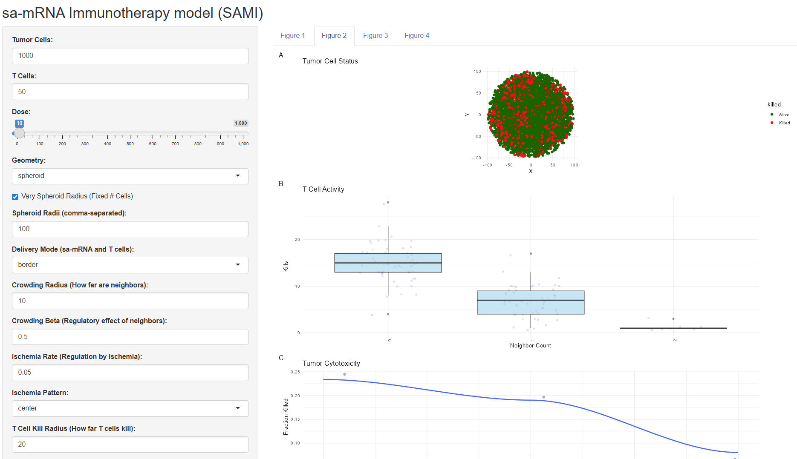

# **sa-mRNA Immunotherapy Model (SAMI)**

The **sa-mRNA Immunotherapy Model (SAMI)** is a computational tool designed to simulate the dynamics of antigen expression and tumor-immune interactions at the single-cell level. It incorporates self-amplifying mRNA (sa-mRNA) technology and includes tumor microenvironment effects such as ischemia, crowding, and immune killing by T cells. This model can be used to study cancer immunotherapies, particularly those utilizing replicon-based mRNA vaccines.

## **Features**

The **SAMI** model simulates several important aspects of tumor-immune interactions, including spatial effects, antigen expression dynamics, immune cell killing, and the impact of environmental factors like ischemia and crowding. The key features include:

### **1. Spatial Tumor Models**
- **Monolayer** and **Spheroid** geometry options: The model can simulate tumor cells arranged in a 2D monolayer or 3D spheroid structure.
- **Spatial Effects**: The model allows for the simulation of **crowding** and **ischemia** effects in the tumor microenvironment, affecting antigen expression and immune response.
  - **Crowding Mode**: Choose between "inhibit" (reduces expression in crowded regions) and "promote" (increases expression in crowded regions) for cell-cell interactions. A **Gaussian kernel** is used for crowding calculations.
  - **Ischemia**: Oxygen and nutrient limitations affect cell survival and antigen expression. You can simulate ischemia patterns either at the **center** or **periphery** of the tumor.

### **2. Antigen Expression and Therapy Dynamics**
- **Stochastic Antigen Expression**: Simulates variable antigen production at the single-cell level, representing natural fluctuations in gene expression.
- **Therapy Settings**: Supports **self-amplifying mRNA (sa-mRNA) therapy** with specific transcription and translation rates.
  - **Replicon Therapy**: Based on predefined rates, mRNA replication and antigen production are modeled to reflect therapeutic dynamics.
  - **Superinfection Resistance**: The model accounts for resistance to superinfection in replicon-based systems, with cells potentially becoming resistant to additional viral infections.

### **3. Immune Response Simulation**
- **T Cell Cytotoxicity**: Simulates the immune system’s response via T cell killing of tumor cells. T cells recognize tumor cells based on antigen expression.
  - **T Cell Parameters**: Configure the number of T cells and their ability to kill tumor cells based on proximity, antigen recognition, and immune exhaustion.
  - **T Cell Killing Radius**: T cells are capable of killing tumor cells within a defined radius, which can be adjusted in the simulation.
  - **Antigen Specificity**: The model allows for customization of antigen recognition by T cells, including recognition of **vaccine** and **innate** antigens, or a more **non-specific** killing mode.

### **4. Environmental Effects**
- **Ischemia**: Simulates nutrient and oxygen limitation, affecting cells differently depending on their position within the tumor (center vs. periphery).
- **Crowding**: Tumor cells interact with each other, which can either inhibit or promote antigen expression depending on the crowding mode selected.

### **5. Adjustable Parameters**
Users can customize the following simulation parameters in the app:
- **Time Points**: Specify the range and interval for the simulation (default: 0 to 24 hours).
- **Viral Dose**: Control the dose of viral mRNA used in therapy (e.g., 10, 100, etc.).
- **Therapy Model**: Set parameters for different therapy types (e.g., Replicon).
- **Spatial Configuration**: Choose between "monolayer" or "spheroid" tumor geometry, and configure spatial effects like delivery mode (random, center, border).
- **T Cell Immune Response**: Enable or disable T cell killing, modify T cell killing radius, antigen specificity, and T cell exhaustion.
- **Crowding and Ischemia**: Adjust crowding effects (inhibition or promotion) and ischemia patterns (center or periphery).

### **6. Simulation Output**
The model outputs the following data for each simulation:
- **Antigen Levels**: Tracks antigen production over time, reflecting the expression of tumor antigens and vaccine-derived antigens.
- **Immune Response**: Logs the number of tumor cells killed by T cells, and identifies which T cell was responsible for each kill.
- **Cell Survival**: Tracks the survival status of tumor cells, including the time of death and the killer T cell’s identity.
- **Spatial Data**: For spatial configurations, the model logs the positions of cells, crowding factors, and ischemia factors, allowing users to visualize the tumor structure and environmental influences.

## **How to Use the SAMI Model**

The **SAMI Model** is packaged as a **ShinyLive** app, allowing you to run simulations directly in your web browser without needing to install any software. Simply follow the steps below:

### **Steps to Run the App**
1. **Download the App**: Download the `SAMI_Model.html` file from this repository. This is a pre-packaged **ShinyLive** app that can run directly in your browser.
2. **Open the HTML File**: Open the `SAMI_Model.html` file in your web browser (Google Chrome, Firefox, or Safari).
3. **Run the App**: The app will load and allow you to configure the simulation parameters (such as dose, therapy settings, spatial configurations, and immune parameters) and run simulations directly in your browser.

### **Adjustable Parameters**
Once the app is loaded, you can adjust the following parameters:
- **Time Points**: Define the simulation time range (e.g., 0 to 24 hours).
- **Viral Dose**: Select the dose of viral mRNA (default: 10).
- **Therapy Settings**: Choose the therapy model (e.g., Replicon) and set relevant parameters like replication rates.
- **Spatial Mode**: Select "monolayer" or "spheroid" tumor configuration.
- **Immune Response Settings**: Enable or disable T cell cytotoxicity, adjust T cell killing radius, antigen specificity, and T cell exhaustion.
- **Crowding and Ischemia**: Customize crowding effects (inhibit/promote) and ischemia patterns (center/periphery).

### **Results Visualization**
The results of each simulation are displayed through interactive visualizations:
- **Antigen Expression**: A time-course plot showing antigen production over time.
- **T Cell Killing**: A summary of T cell interactions with tumor cells, including which T cells killed which tumor cells.
- **Tumor Cell Survival**: Survival curves for tumor cells based on therapy, dose, and immune interactions.
- **Spatial Data**: For spatial models, visualizations of tumor geometry, cell positions, and the impact of ischemia and crowding.

## **Citation**

If you use **SAMI** in your research, please cite the following:

**Darshak K. Bhatt**  
*sa-mRNA Immunotherapy Model (SAMI)*  
November 2025

---
